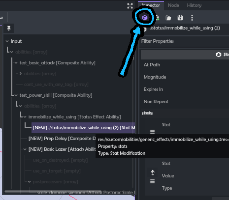

# Subresource Inspector

It inspects subresources.

⚡ Must be ENABLED to be used! `Project` -> `Project Settings` -> `Plugins`

- Inspect contents of Nodes and Resources
- See if any resources inside are built-in and not in separate files
- See resource types at a glance
- Open full inspector by clicking an item
- Pin root node/resource to prevent view from changing
